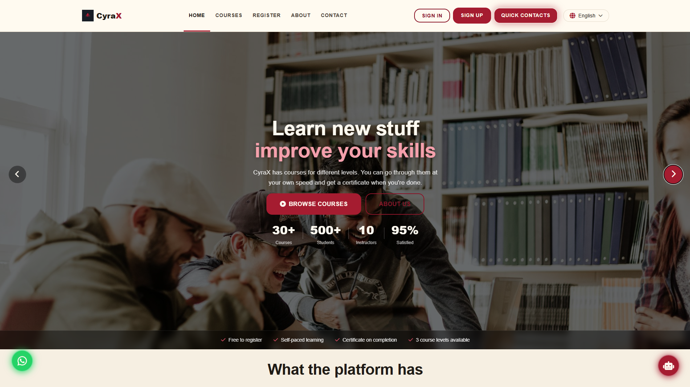
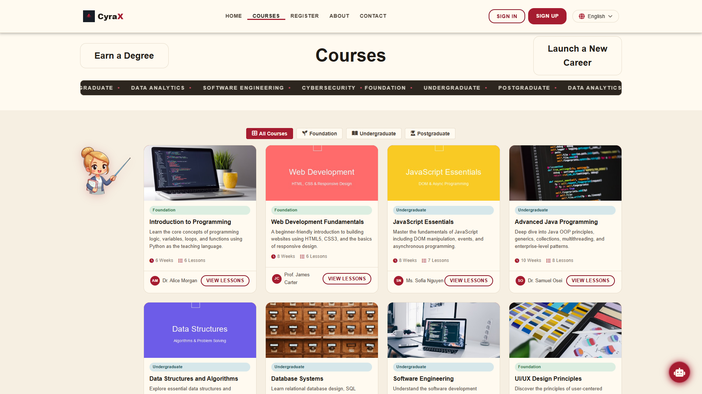
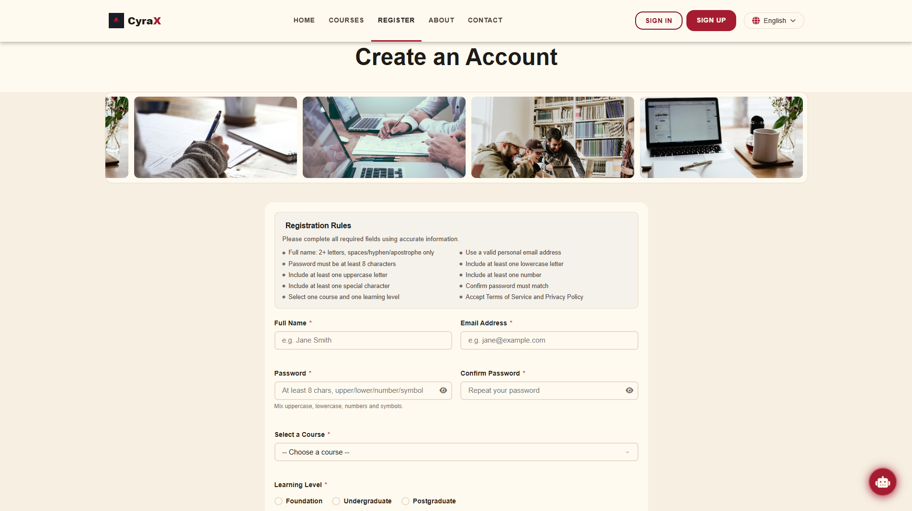
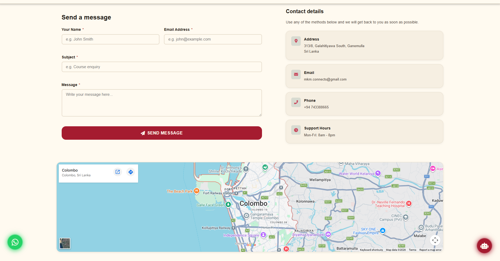
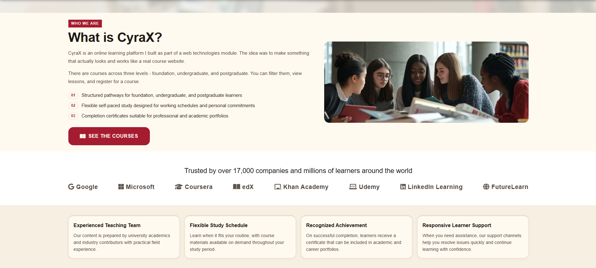
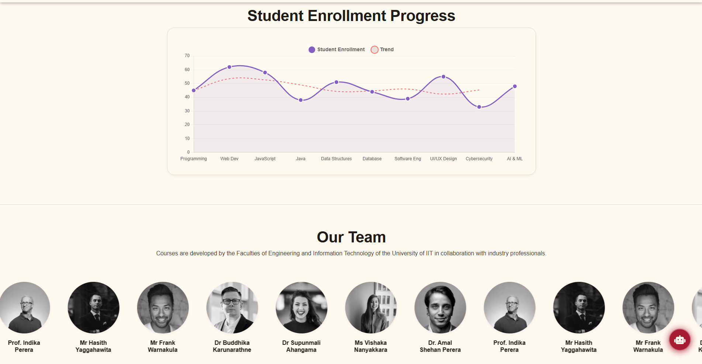

# CyraX – Online Learning Platform

CyraX is a responsive, front-end web application that models a modern online learning platform.
It was developed to demonstrate practical implementation of UI/UX design, client-side logic, and structured data handling in a real-world context.

---

## Live Demo

🔗 [https://your-username.github.io/your-repo-name/](https://mkmconnects-byte.github.io/CyraX-Learning-Platform/)

---

## Screenshots

### Home Interface



### Course Catalogue



### User Registration



### Contact Interface



### Platform Overview




---

## Core Functionality

* Structured course pathways across multiple levels (Foundation, Undergraduate, Postgraduate)
* Dynamic course rendering using XML data sources
* Client-side filtering and interactive lesson navigation
* Comprehensive form validation with real-time feedback
* Multi-language interface support (English, Sinhala, Tamil)
* Responsive layout optimized for various screen sizes
* Interactive UI components including carousels and animated sections
* Data visualization using Chart.js

---

## Technology Stack

**Frontend**

* HTML5
* CSS3 (component-based structure)
* JavaScript (ES6, vanilla)

**Data Handling**

* XML for course data management

**Libraries & Tools**

* Chart.js (data visualization)
* Font Awesome (icons)

---

## Project Structure

```
CyraX/
│
├── index.html
├── about.html
├── courses.html
├── contact.html
├── register.html
├── courses.xml
│
├── css/
│   ├── global.css
│   ├── pages.css
│   └── components.css
│
├── assets/
│   ├── images/
│   ├── team/
│   └── screenshots/
│
└── js/
```

---

Run using a local development server (recommended for XML data loading):

* VS Code → Live Server extension
  or
* Any static server (e.g., Python, Node.js)

---

## Implementation Highlights

**Dynamic Course System**
Course data is stored in XML and parsed on the client side to generate course listings and lesson structures dynamically.

**Form Validation**
Custom validation logic ensures data integrity for user inputs, including password strength rules and structured feedback.

**UI Architecture**
The interface follows a modular CSS approach with reusable components, ensuring consistency and scalability.

---

## Future Enhancements

* Backend integration (authentication and persistence)
* User dashboard and progress tracking
* Course enrollment management
* API-based data handling (JSON/REST)
* Performance optimization and accessibility improvements

---

## Author

mkm.connects
GitHub: [https://github.com/your-username](https://github.com/mkmconnects-byte)

---

## License

This project is developed for academic and demonstration purposes.
